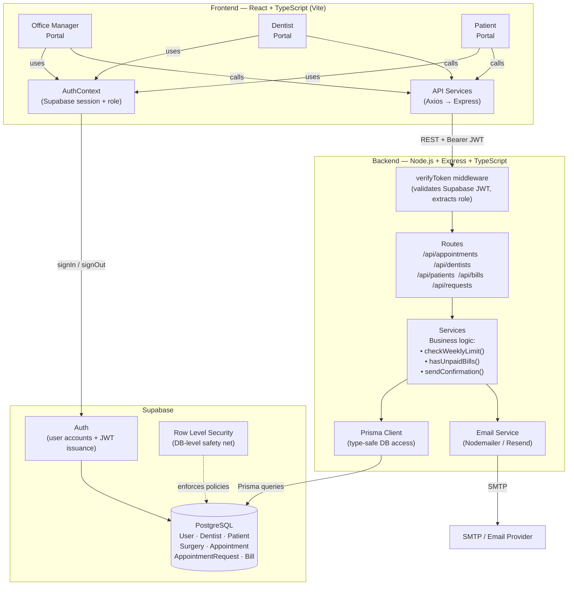
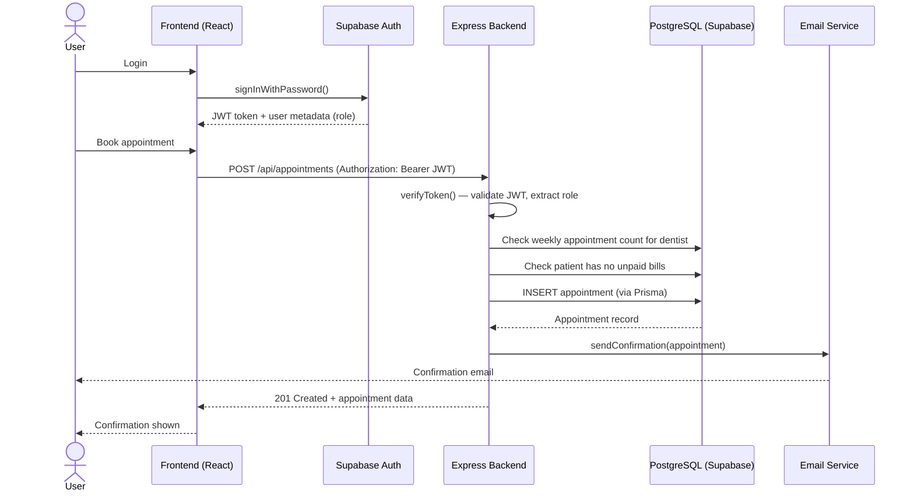
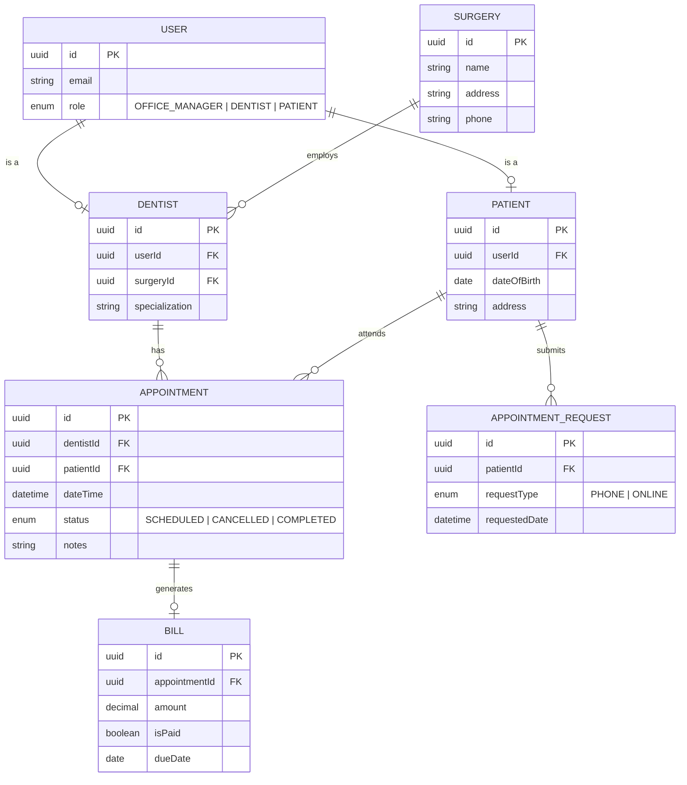

# Architecture Diagram

## System Overview

```mermaid
flowchart TB
    subgraph FE["Frontend — React + TypeScript (Vite)"]
        direction LR
        OM["Office Manager\nPortal"]
        DE["Dentist\nPortal"]
        PA["Patient\nPortal"]
        AC["AuthContext\n(Supabase session + role)"]
        AX["API Services\n(Axios → Express)"]
    end

    subgraph BE["Backend — Node.js + Express + TypeScript"]
        direction TB
        MW["verifyToken middleware\n(validates Supabase JWT, extracts role)"]
        RT["Routes\n/api/appointments  /api/dentists\n/api/patients  /api/bills  /api/requests"]
        SV["Services\nBusiness logic:\n• checkWeeklyLimit()\n• hasUnpaidBills()\n• sendConfirmation()"]
        PC["Prisma Client\n(type-safe DB access)"]
        EM["Email Service\n(Nodemailer / Resend)"]
    end

    subgraph SB["Supabase"]
        direction LR
        AU["Auth\n(user accounts + JWT issuance)"]
        PG[("PostgreSQL\nUser · Dentist · Patient\nSurgery · Appointment\nAppointmentRequest · Bill")]
        RL["Row Level Security\n(DB-level safety net)"]
    end

    SMTP["SMTP / Email Provider"]

    OM & DE & PA -->|"uses"| AC
    OM & DE & PA -->|"calls"| AX

    AC -->|"signIn / signOut"| AU
    AX -->|"REST + Bearer JWT"| MW

    MW --> RT
    RT --> SV
    SV --> PC
    SV --> EM

    PC -->|"Prisma queries"| PG
    AU --> PG
    RL -.->|"enforces policies"| PG
    EM -->|"SMTP"| SMTP
```

---

## Request Lifecycle

```mermaid
sequenceDiagram
    actor User
    participant FE as Frontend (React)
    participant SB as Supabase Auth
    participant BE as Express Backend
    participant DB as PostgreSQL (Supabase)
    participant Mail as Email Service

    User->>FE: Login
    FE->>SB: signInWithPassword()
    SB-->>FE: JWT token + user metadata (role)

    User->>FE: Book appointment
    FE->>BE: POST /api/appointments (Authorization: Bearer JWT)
    BE->>BE: verifyToken() — validate JWT, extract role
    BE->>DB: Check weekly appointment count for dentist
    BE->>DB: Check patient has no unpaid bills
    BE->>DB: INSERT appointment (via Prisma)
    DB-->>BE: Appointment record
    BE->>Mail: sendConfirmation(appointment)
    Mail-->>User: Confirmation email
    BE-->>FE: 201 Created + appointment data
    FE-->>User: Confirmation shown
```

---

## Data Model

```mermaid
erDiagram
    USER {
        uuid id PK
        string email
        enum role "OFFICE_MANAGER | DENTIST | PATIENT"
    }
    SURGERY {
        uuid id PK
        string name
        string address
        string phone
    }
    DENTIST {
        uuid id PK
        uuid userId FK
        uuid surgeryId FK
        string specialization
    }
    PATIENT {
        uuid id PK
        uuid userId FK
        date dateOfBirth
        string address
    }
    APPOINTMENT {
        uuid id PK
        uuid dentistId FK
        uuid patientId FK
        datetime dateTime
        enum status "SCHEDULED | CANCELLED | COMPLETED"
        string notes
    }
    APPOINTMENT_REQUEST {
        uuid id PK
        uuid patientId FK
        enum requestType "PHONE | ONLINE"
        datetime requestedDate
    }
    BILL {
        uuid id PK
        uuid appointmentId FK
        decimal amount
        boolean isPaid
        date dueDate
    }

    USER ||--o| DENTIST : "is a"
    USER ||--o| PATIENT : "is a"
    SURGERY ||--o{ DENTIST : "employs"
    DENTIST ||--o{ APPOINTMENT : "has"
    PATIENT ||--o{ APPOINTMENT : "attends"
    APPOINTMENT ||--o| BILL : "generates"
    PATIENT ||--o{ APPOINTMENT_REQUEST : "submits"
```
