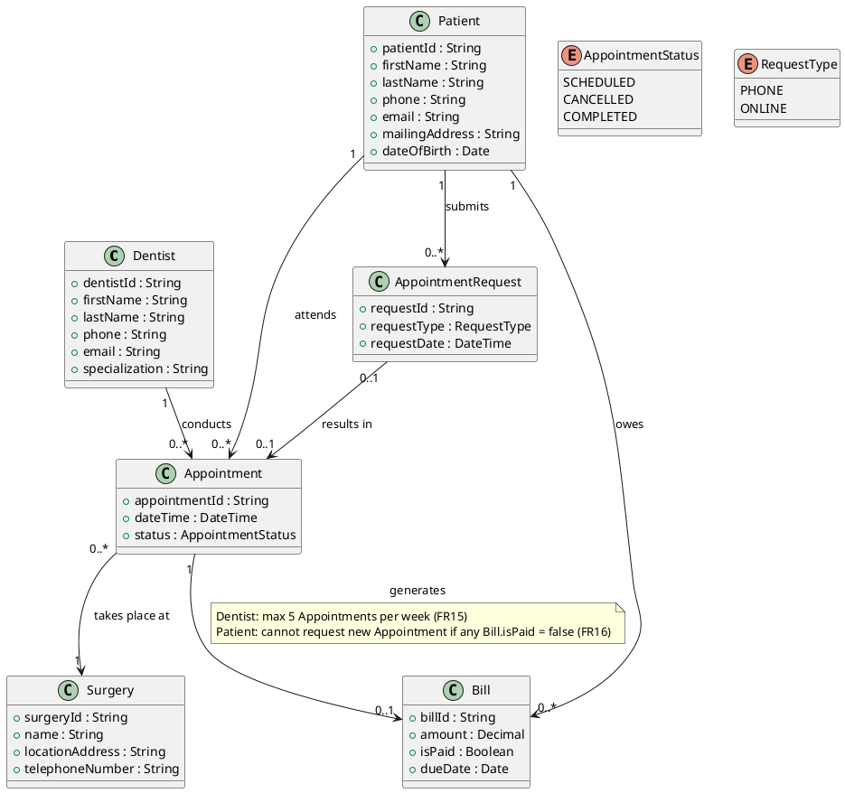

```plantuml
@startuml DentalSurgeryDomainModel

class Dentist {
  + dentistId : String
  + firstName : String
  + lastName : String
  + phone : String
  + email : String
  + specialization : String
}

class Patient {
  + patientId : String
  + firstName : String
  + lastName : String
  + phone : String
  + email : String
  + mailingAddress : String
  + dateOfBirth : Date
}

class Appointment {
  + appointmentId : String
  + dateTime : DateTime
  + status : AppointmentStatus
}

class AppointmentRequest {
  + requestId : String
  + requestType : RequestType
  + requestDate : DateTime
}

class Surgery {
  + surgeryId : String
  + name : String
  + locationAddress : String
  + telephoneNumber : String
}

class Bill {
  + billId : String
  + amount : Decimal
  + isPaid : Boolean
  + dueDate : Date
}

enum AppointmentStatus {
  SCHEDULED
  CANCELLED
  COMPLETED
}

enum RequestType {
  PHONE
  ONLINE
}

Patient "1" --> "0..*" AppointmentRequest : submits
AppointmentRequest "0..1" --> "0..1" Appointment : results in
Patient "1" --> "0..*" Appointment : attends
Dentist "1" --> "0..*" Appointment : conducts
Appointment "0..*" --> "1" Surgery : takes place at
Patient "1" --> "0..*" Bill : owes
Appointment "1" --> "0..1" Bill : generates

note on link
  Dentist: max 5 Appointments per week (FR15)
  Patient: cannot request new Appointment if any Bill.isPaid = false (FR16)
end note

@enduml
```
