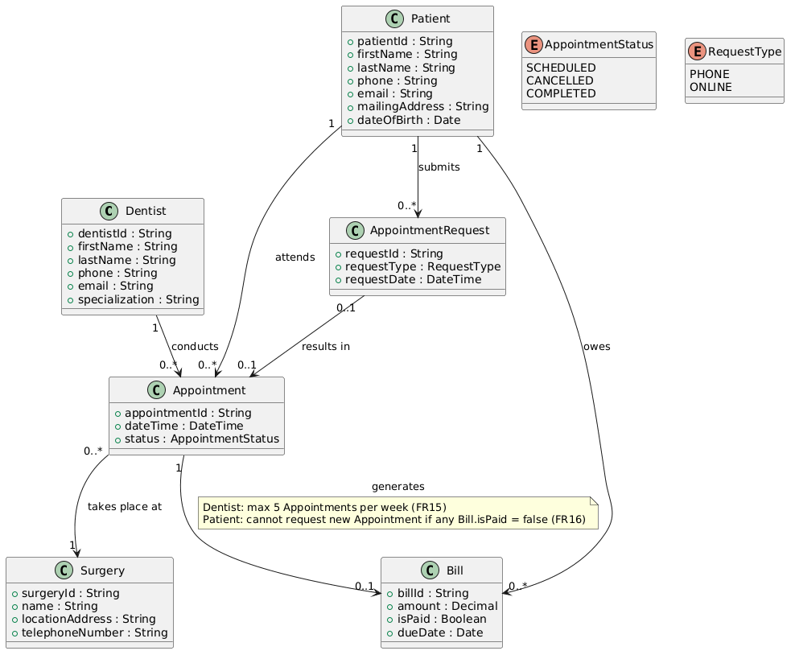

# Dental Surgery Operations System

### Analysis, Design, and Implementation Overview

Presented by: Gideon Bamuleseyo

---

# Agenda

- Problem statement
- System requirements
- Domain model
- Architecture and technology stack
- Key business rules
- Implementation overview
- Testing and demo scenarios
- Conclusion

---

# Problem Statement

- Dental surgeries need a system to manage dentists, patients, appointments, requests, surgeries, and bills.
- The office manager handles registration and booking.
- Dentists need to sign in and view their schedules.
- Patients need to sign in, request appointments, and manage existing bookings.
- The solution must also enforce important business constraints.

---

# Project Objectives

- Digitize appointment and patient management
- Support three user roles:
  - Office Manager
  - Dentist
  - Patient
- Centralize surgery and billing information
- Enforce scheduling and billing rules automatically
- Provide a clean full-stack web solution

---

# Functional Requirements

- Register dentists with unique details and specialization
- Enroll patients with contact and demographic information
- Accept appointment requests by phone or online
- Allow the office manager to book appointments
- Send confirmation emails after booking
- Let dentists and patients log in and view appointments
- Allow patients to cancel or reschedule appointments
- Store surgery information for all locations

---

# Critical Business Rules

- A dentist cannot have more than **5 appointments in one calendar week**
- A patient with an **unpaid bill** cannot request a new appointment
- These rules are enforced in the backend service layer
- This ensures the rules are applied consistently for every API request

---

# Main Actors in the System

- **Office Manager**
  - Registers dentists
  - Enrolls patients
  - Books appointments
  - Manages bills

- **Dentist**
  - Logs in
  - Views scheduled appointments

- **Patient**
  - Logs in
  - Requests appointments
  - Views, cancels, or reschedules appointments

---

# Domain Model

Core entities in the system:

- User
- Dentist
- Patient
- Surgery
- Appointment
- AppointmentRequest
- Bill

Key relationships:

- A `User` can be linked to a `Dentist` or `Patient`
- A `Surgery` has many `Dentists`
- A `Dentist` and `Patient` participate in many `Appointments`
- An `Appointment` may generate one `Bill`

---

# UML / Domain Diagram

---

# System Architecture

- **Frontend:** React + TypeScript
- **Backend:** Node.js + Express + TypeScript
- **Database:** MongoDB with Mongoose
- **Authentication:** JWT-based role authentication
- **Email:** Confirmation email service

Architecture style:

- Layered monolith
- REST API + Single Page Application

---

# High-Level Architecture Flow

1. User logs in and receives a JWT
2. Frontend sends requests with `Authorization: Bearer <token>`
3. Express middleware validates the token and extracts the user role
4. Controllers forward requests to services
5. Services enforce business rules
6. Mongoose models save and retrieve data from MongoDB

---

# Planned and Implemented API Areas

- `POST /api/auth/register`
- `GET /api/dentists`
- `GET /api/patients`
- `GET /api/appointments`
- `POST /api/appointments`
- `PUT /api/appointments/:id/cancel`
- `PUT /api/appointments/:id/reschedule`
- `POST /api/requests`
- `GET /api/bills/:patientId`
- `PUT /api/bills/:id/pay`

---

# Implementation Overview

Backend includes:

- Routes
- Controllers
- Services
- Middleware
- Mongoose models
- Integration and unit tests

Frontend includes:

- Separate pages for Office Manager, Dentist, and Patient
- Auth context and protected routes
- API client modules
- Dashboard and management screens

---

# Example Features Already Covered

- Dentist and patient management
- Appointment booking, cancellation, and rescheduling
- Appointment request handling
- Bill viewing and payment updates
- Demo seed data for presentation scenarios
- Role-based UI pages for the three user groups

---

# Testing Strategy

- **Unit tests**
  - Service-layer business rules
  - Weekly appointment limit
  - Unpaid bill blocking

- **Integration tests**
  - Appointment routes
  - Request routes

- This helps verify both correctness and rule enforcement

---

# Demo Scenarios

- Office Manager registers a dentist or patient
- Patient submits an appointment request
- Office Manager books the appointment
- System sends a confirmation email
- Dentist views scheduled appointments
- Patient views appointments and bills
- System blocks:
  - a 6th weekly appointment for a dentist
  - a new request from a patient with an unpaid bill

---

# Design Strengths

- Clear separation of concerns
- Role-based access control
- Business rules enforced centrally
- TypeScript used across frontend and backend
- Realistic healthcare workflow coverage
- Easy to extend with reporting, notifications, or admin analytics

---

# Conclusion

- The project addresses a realistic dental operations workflow
- It covers requirements analysis, domain modeling, architecture, and implementation
- The system supports all major user roles and core operations
- Most importantly, it enforces the key business constraints required by the problem

---

# Q&A

Thank you
